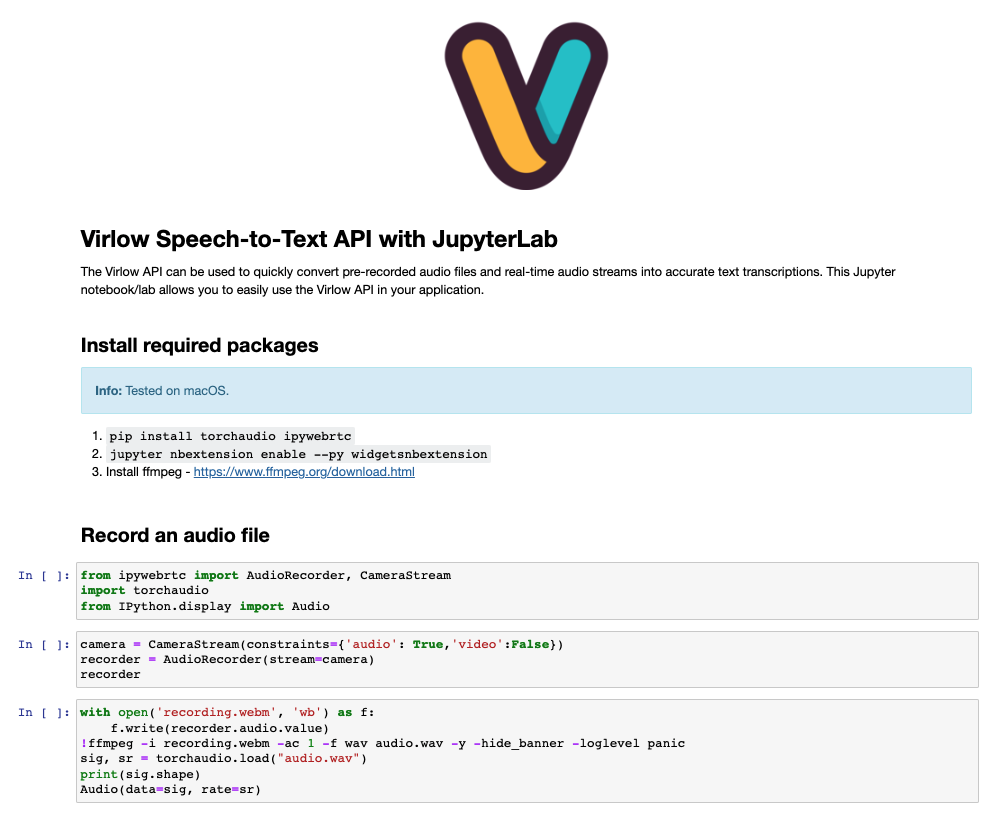

# Virlow Speech-to-Text API with JupyterLab

The Virlow API can be used to quickly convert pre-recorded audio files and real-time audio streams into accurate text transcriptions. This Jupyter notebook/lab allows you to easily use the Virlow API in your application.

## Install required packages

1. `pip install torchaudio ipywebrtc`
1. `jupyter nbextension enable --py widgetsnbextension`
1. Install ffmpeg - https://www.ffmpeg.org/download.html

## Run your notebook

